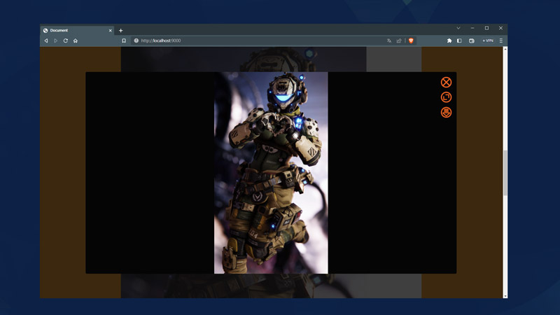

# JoyReactor Improved - Image Viewer
Заменяет стандартное окно сайта JoyReactor.cc для просмотра изображений  на более удобное и функциональное. Что сделает просмотр изображений более приятным и комфортным.

## Установка
#### [для браузера на основе Chromium](https://github.com/Melserval/JoyReactorImproved-ImageViewer-Chromium#readme)
#### [для браузера Firefox](https://github.com/Melserval/JoyReactorImproved-ImageViewer-Firefox#readme)

## Использование
### Браузер компьютера
В правом верхнем углу открытого окна просмотра есть несколько кнопок которые позволяют:
- Закрыть окно просмотра и крутить ленту постов дальше, в поисках достойной просмотра картинки.
- Развернуть окно просмотра изображений на весь экран с помощью кнопки разворота. Это позволит лучше рассмотреть детали изображения и насладиться его качеством.
- Скачать просматриваемое в окне изображение с помощью кнопки скачивания. Это позволит сохранить изображение на компьютер без лишних телодвижений.
- Клик по открытому в просмотрщике изображению увеличит просматриваемое изображение до максимального размера. Это доступно только для изображений, реальный размер которых больше чем окно просмотра. Повторный клик по увеличенному изображению вернет его к исходному размеру.

### Браузер смартфона
Все работает так же, только кнопки управления перемещены вниз окна просмотра (см. четвертый скриншот).
- нижняя левая область - закрыть окно.
- нижняя центральная область - развернуть на весь экран.
- нижняя правая облать - скачать открытое изображение.

## Примеры
##### 1. Вид в обычном режиме.

##### 2. Вид в режиме на весь экран.

##### 3. Вид при просмотре изображения в оригинальном размере.

##### 4. Просмотр с мобильного устройства, обычный режим.

